# HealthHorizon - Fitness Tracker UI

Welcome to the **HealthHorizon** repository! This project showcases the **UI design** for a health and fitness tracker app built with **Android XML** and **Kotlin** in **Android Studio**. HealthHorizon is designed to provide users with an intuitive, engaging, and aesthetically pleasing interface to track their fitness and health journey.

**Note:** This repository focuses solely on the **UI design** of the app. The core functionality (such as tracking fitness metrics, user authentication, and database management) is not implemented in this repository. The primary goal of this project is to showcase the design elements and interface components of a fitness tracker app.

## Table of Contents

- [About the App](#about-the-app)
- [Features](#features)
- [Installation Instructions](#installation-instructions)
- [Screenshots](#screenshots)

## About the App

HealthHorizon is a fitness tracker app that helps users stay on top of their health and fitness goals. Through an intuitive user interface, the app tracks daily achievements such as calories burned, step count, distance traveled, and more. The app also provides workout categories and a detailed workout history, ensuring users have everything they need to make informed decisions about their health and fitness journey.

### Target Audience

- **Fitness Enthusiasts** looking to track daily activity and achieve fitness goals.
- **Individuals seeking healthier lifestyles** by tracking key metrics such as calories, water intake, and steps.
- **Beginners** who are just starting their fitness journey and need a simple yet effective app.

### Problem it Solves

HealthHorizon makes it easier for individuals to track and visualize their fitness activities, ensuring they stay motivated and on track to achieve their health and fitness goals. It provides a clear overview of health metrics and workout history, helping users stay focused and achieve their targets.

## Features

- **Logo/Opening Page**: Sleek modern introduction with the HealthHorizon logo.
- **Onboarding Screens**: Three informative screens guiding users through the app’s features.
- **Sign-In and Sign-Up Pages**: Easy and secure authentication.
- **Home Page**: A central hub displaying daily goals, calories burned, step count, distance traveled, and water intake.
- **Workout Page**: Multiple categories such as jogging, cycling, yoga, and exercise.
- **Jogging Page**: Specialized section for jogging, with GPS tracking and metrics like calories burned, pace, and heart rate.
- **Profile Page**: Edit personal details, log out, or delete account.
- **Workout History Page**: Detailed record of all past workouts, including types and statistics.

## UI/UX Design

- **Color Scheme**: The app follows the **60-30-10 rule** for color usage:
  - **Primary Color (60%)**: Pure white tones to represent health and vitality. 
    - Code: `#FFFFFF` (white)
  - **Secondary Color (30%)**: Light blues for a clean and minimalistic design. 
    - Code: `#3379AD` (blue)
  - **Accent Color (10%)**: Deep blue tones for call-to-action elements and highlights.
    - Code: `#03346E` (dark blue)

  Additionally, the neutral colors used in the app:
  - **Black**: 
    - Code: `#FF000000` (black)

- **Layouts**: The app utilizes a mix of:
  - **Linear Layouts** (Horizontal/Vertical) for streamlined navigation.
  - **Constraint Layouts** for flexibility and better performance.
  - **Frame Layouts** for centered, full-screen images.
  - **Scroll Views** to ensure all content fits well on different screen sizes.

- **Views**: TextViews, EditTexts, Buttons, ImageViews, and more, ensuring all user interactions are smooth and intuitive.

## Installation Instructions

### Prerequisites:
- **Android Studio**: Ensure you have Android Studio installed on your machine.

### Steps:
1. Clone the repository:
   ```bash
   git clone https://github.com/Kavinigamalath/HealthHorizon.git
## Screenshots

### 1. **Logo/Opening Page**
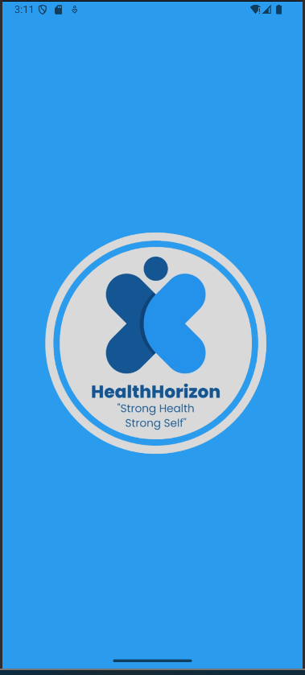

*This is the initial logo and opening screen of the app.*

---

### 2. **Onboarding Screens**
#### Onboarding Screen 1
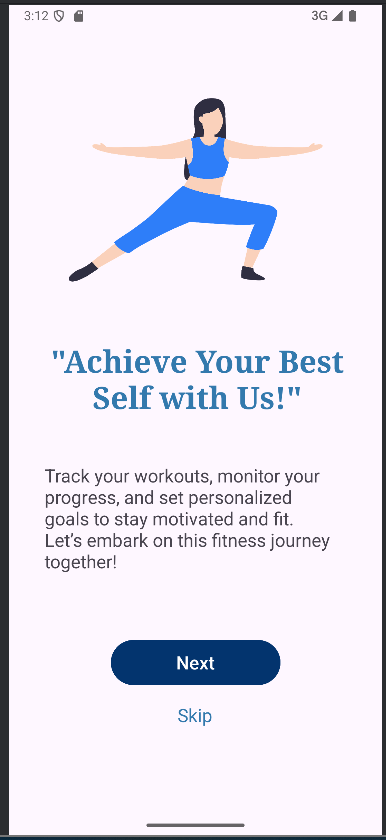

*First screen in the onboarding process that introduces the app.*

#### Onboarding Screen 2
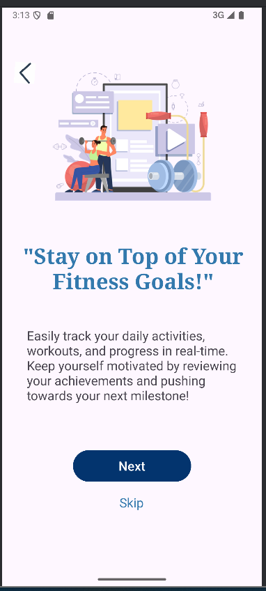

*Second onboarding screen providing more information.*

#### Onboarding Screen 3


*Final onboarding screen highlighting key app features.*

---

### 3. **Authentication Pages**
#### Sign-In Page
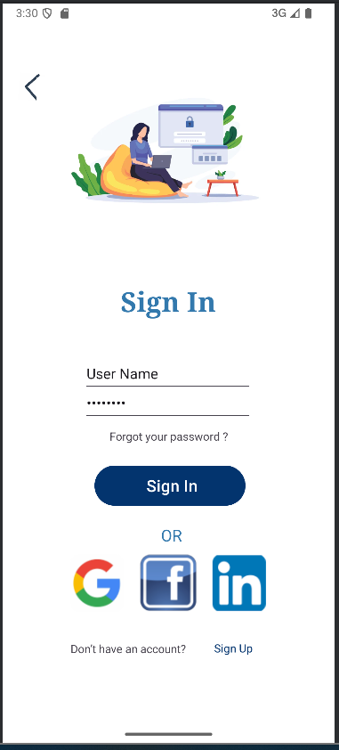

*Page where users can log in with their credentials.*

#### Sign-Up Page
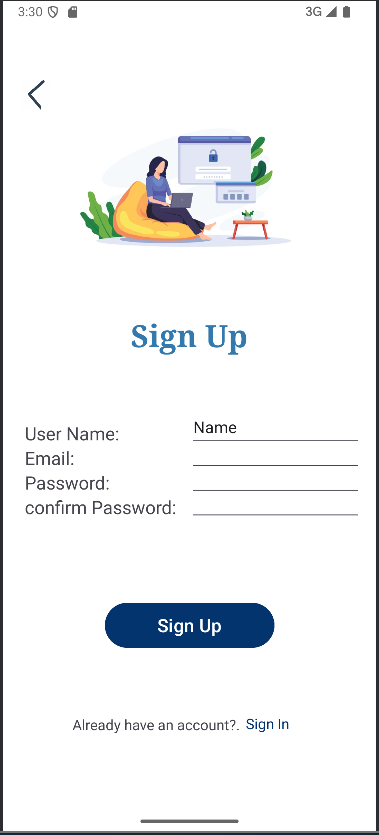

*Page for new users to create an account.*

---

### 4. **Home Page**
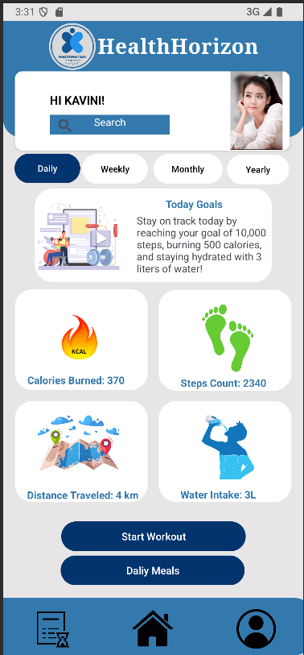

*The central hub of the app, displaying daily fitness metrics like steps, calories burned, and water intake.*

---

### 5. **Workout Page**
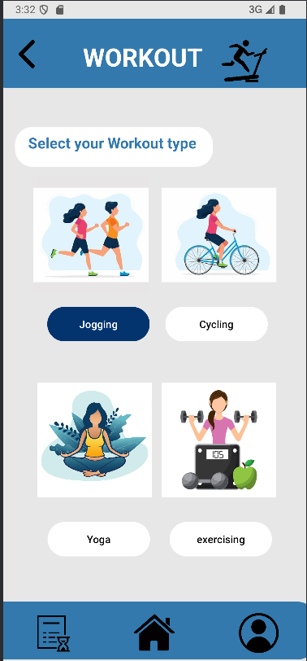

*Page where users can select different workout types such as jogging, cycling, and yoga.*

---

### 6. **Jogging Pages**
#### Jogging Start Page
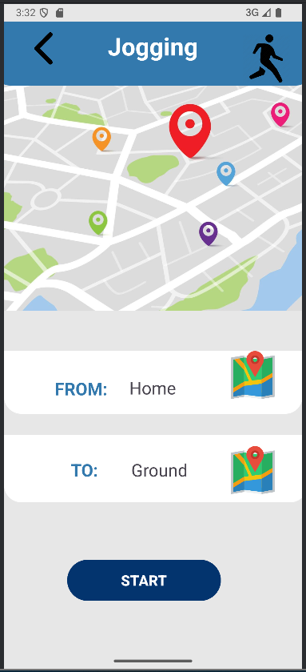

*Page for users to start a jogging session, tracking metrics like calories and pace.*

#### Jogging Stop Page
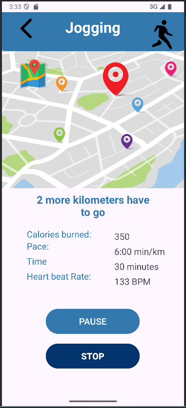

*Page that appears when the jogging session is stopped, displaying a pause screen.*

#### Jogging Summary Page
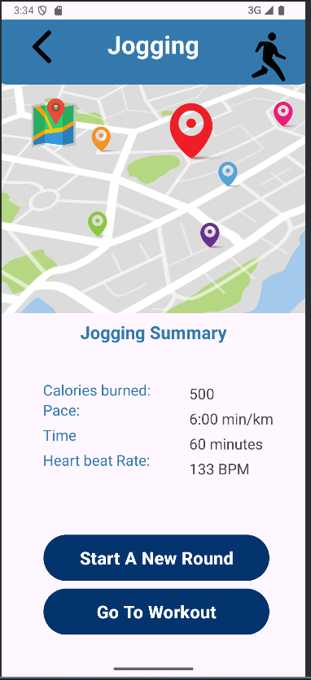

*Page showing a detailed summary of the jogging session, including calories burned and distance.*

---

### **Other Pages**

### 7. **Profile Page**
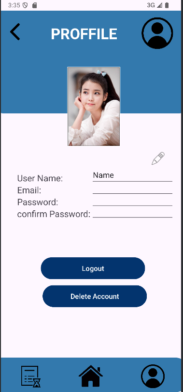

*Page where users can edit their profile, log out, or delete their account.*

---

### 8. **Workout History Page**
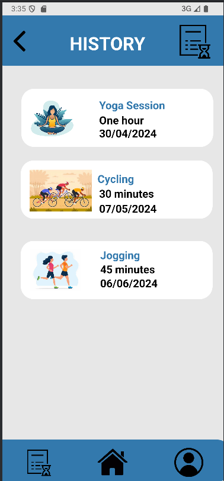

*Page showing a history of all the user’s previous workouts and their details.*


